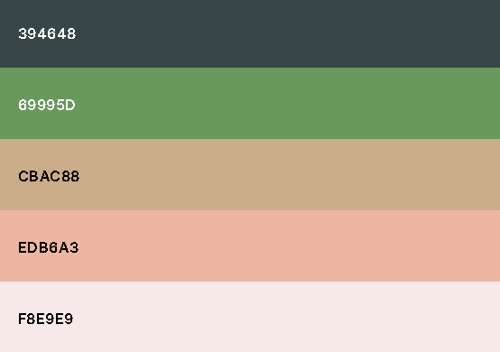

# LOVE VEGETABLES

Responsiveness images

[View the live project here]()

# Table of Content

1. [Introduction](#introduction "Goto introduction")

2. [UX](#ux "Goto ux")

    - [Ideal User Demographic](#ideal-user-demographic "Goto ideal user demographic")
    - [User Stories](#user-stories "Goto user stories")
    - [Development Planes](#development-planes "Goto development planes")
    - [Design](#design "Goto design")

3. [Features](#features "Goto features")

    - [Existing and Design Features](#existing-and-design-features "Goto existing & design features")
    - [Features to Implement in the future](#features-to-implement-in-the-future "Goto features to implement in the future")
    
4. [Testing](#testing "Goto testing")

    - [Testing.md](#)

5. [Issues and bugs](#issues-and-bugs "Goto issues and bugs")

6. [Technologies used](#technologies-used "Goto technologies used")
 
    - [Main Languages Used](#main-languages-used "Goto main languages used")
    - [Libraries, Frameworks and Programs Used](#libraries-frameworks-and-programs-used "Goto libraries, frameworks and programs used")
    
7. [Deployment](#deployment "Goto deployment")

    - [Deployment on Github Pages](#deployment-on-github-pages "Goto deployment on github pages")
    - [Forking the Repository](#forking-the-repository "Goto forking the repository")
    - [Creating a Clone](#creating-a-clone "Goto creating a clone")

8. [Cedits](#credits "Goto credits")

    - [Content](#content "Goto content")
    - [Media](#media "Goto media")
    - [code](#code "code")

9. [Acknowledgements](#acknowledgements "Goto acknowledgements")
---

# INTRODUCTION

Love Vegetables is a fun interactive website that involves the user in a vegetables knowledge quiz. It is a timed multiple choice game, with random questions each time the user starts the quiz.  The user can see the instructions on the quiz, before starting and after finishing the quiz, the user can see their score and have the option to replay. 

This is the second of five Milestone Projects that the developer must complete during his Full Stack Web Development at The Code Institute. The main requirements were to make a responsive and interactive website using primarily *HTML5*, *CSS3* and *JavaScript*.

# UX

## Ideal User Demographic

### The ideal user of this quiz

* People who enjoy food and vegetables quiz
* Lovers of cooking and food
* Vegetarian
* Quiz lovers
* People who want a quick, simple and elegant quiz application.

## User Stories

### As a new user:

* I would like to see where to start playing
* I would like to navigate easiliy to the website
* I would like to know the instructions before starting the quiz
* I would like to know how much time and how many questions I have left
* I would like to leave the quiz whenever I want
* I would like to have a feedback when I finish the quiz
* I would like to be able to ask for help 
* I would like to easily navigate through the Love Vegetables' social media links to be familiar with the Love Vegetables community

### As an old/returning user:

* I would like to navigate easily to the online quiz
* I would like to see new questions

### As a website creator:

* I want to make the quiz fun and interactive
* I want to provide easy access to the user to ask questions
* I want to ensure that there are enough questions
* I want to make sure that the user enjoys the quiz
* I want to provide a communication channel for new and returning customers (social links)

## Development Planes

To create an interactive and fun quiz that displays all data clearly with consistent styling across all pages, Love Vegetables owner worked with its developer to discern the required functionality of the quiz and how it would respond to the stories and expectations of users, as described above. 

### Strategy

The quiz will be focus on the following three categories of target audiences:

1. Demographic
    * All ages
    * Vegetarians

2. Position
    * New users
    * Returning users

3. Centre of interest
    * People who enjoy food and vegetables quiz
    * Lovers of cooking and food
    * Quiz lovers
    * People who want a quick, simple and elegant quiz application.

The online quiz needs to facilitate the user to:

1. Access informations below:
    * The instructions before starting to play
    * Social platforms for the Love Vegetables  
    * The feedback after finishing to play

2. Ask for help and see how to play the quiz

The online quiz needs to facilitate the Love Vegetables Owner to:

1. Maintain an online presence
2. Get more players
3. Receive questions from users in order to improve the quiz

### Scope

There are two categories of requirements that were defined in order to clearly identify what needed to be done to align the functionality with the previously defined strategy.

1. Content Requirements

    * The user will be looking for:
        - Where to start playing
        - How to play
        - The instructions
        - The feedback
        - Where to ask for help
        - Social links

2. Functionality Requirements

    * The user will be able to:
        - Navigate easily through the site to find information he wants
        - Find links to external sites in order to stay connected with the Love Vegetables' community
        - Contact the help centre directly through the site.

### Structure

The structure of the application has been designed to provide a simple and seamless user experience. A simple design will be implemented on all pages. The flow of the pages will be natural and will allow the user to feel comfortable after viewing a single page.

1. Header

    * The logo will serve as a link to the homepage
    * The navigation will be the same on all pages, allowing for quick movement and easy navigation.

2. The Start button

    * The button that will lead directly to the instructions

3. The instructions box

    * The box with the instructions will contain the instructions and two buttons at the bottom: 
        - Exit: will take the user back to the home page
        - Continue: will lead the user directly to the quiz 

4. Quiz

    * A counter to show what question the user is on
    * A counter that shows the user how much time he has left
    * Questions
    * Four answers buttons of which onli one is correct
    * Two buttons:
        - Restart: will restart the quiz
        - Next: will pass to another question

5. Feedback

    * A small message that will tell the user their score
    * Two butons:
        - Exit: Will take the user back to the home page
        - Play again: will lead again the user directly to the quiz

6. Help

    * Quick and brief description on how to play the quiz
    * Contact form

7. Footer

    * Social media links
        - Facebook
        - Instagram
        - YouTube

### Skeleton

Wireframes moch-up were created in a balsamiq workspace with providing a responsiviness and positive user experience in mind.

* Desktop:

Home page, Instructions box, Quiz box, feedback box and Help page

* Tablet:

Home page, Instructions box, Quiz box, feedback box and Help page

* Phone:

Home page, Instructions box, Quiz box, feedback box and Help page

## Design

1. Typography

    * A combination of [Mate SC](https://fonts.google.com/specimen/Mate+SC?query=mate+sc) and [Montserrat](https://fonts.google.com/specimen/Montserrat?query=monts) fonts are used throughout the quiz, with Sans Sérif as a back-up font in case of import failure.
    * For elements that need to be coloured, they have just been styled with the desired colour.

2. Colour Scheme

    * The colours used throughout the site for its main styling are shown below, this mix of colours comes from [coolors](https://coolors.co/) and they have been picked to keep within the design brief of maintaining a simplified pleasure.

    * These colours are used in a specific and complementary way, maintaining a good level of contrast.

3. Images and Icons

    * A single authentic and aesthetic image has been used on all pages as a background. This image is eye-catching and visually represents the theme of the website. This image was taken from[Pexels](https://www.pexels.com/).

    * Several icons have been used in the site. [Font Awesome](https://fontawesome.com/) was the main source of icons.

# FEATURES

## Existing and Design features

### HOME PAGE

1. Header Logo & Navigation Bar

    * The site has a consistent responsive navigation system that is found on every page and allows user to navigate easily from page to page without complications.

    * The header contains a conventionally placed logo at the top left of the page (redirects the user to the home page in one click) and a navigation bar at the top right of the page.

    * The header is fixed so the user can see it if he goes to the bottom of the page.

2. Landing page 

    * The landing includes an image as a background with a question overlaid and a button to start the quiz, this button allows the user to accss the quiz.

3. Instructions section

    * This section allows the user to view the quiz instructions before starting to play.
    * It also allows the user to either exit or continue the quiz.
    * It is represented by a box of text (instructions) with the same background as the landing page.
    * In fact, this section is hidden and to see it, just click on the start quiz button in the landing page.

    

4. Quiz section

    * This section allows the user to view :
        - The quiz and start playing.
        - A counter that show what question user is on
        - A counter that shows the user how much time he has left
        - Questions
        - Four answers buttons of which only one is correct

    * It also allows the user to either move on to another question or restart the quiz.
    * It is represented by a box of text (quiz) with the same background as the landing page.
    * In fact, this section is hidden and to see it, just click on the continue button on the bottom right in the instructions box.

 

5. Feedback section

    * In this section, the user will have the feedback on his quiz. He will be able to see his score and make the choice to eitheir restart the quiz or exit the quiz. 
    * It is represented by a box of text (feedback) with the same background as the landing page.
    * In fact, this section is hidden and to see it, just finish the quiz.

6. Help page

    * This page allows the user to see how to play and to submit questions to the creator.
    * It is represented by a box of text and contact form with the same background as the landing page.

7. Submit section 

    * A thank you message will be addressed to the user after sending his question.

8. Footer

    * This section provides the links to the main Love Vegetables social pages with a light background color, just click on the icon to be redirected to the platform of the centre of your choice. 

    * This section is on every page of the site and allows customers to stay connected with the Love Gegetables community.

## Features to implement in the future

1. Difficulty mode
2. Dark mode
3. Implement the progressive Web Application (PWA) to allow users to install the application on their own devices.

For the three features to be implemented in the future above, the web developer needs more knowledge on this subject.
